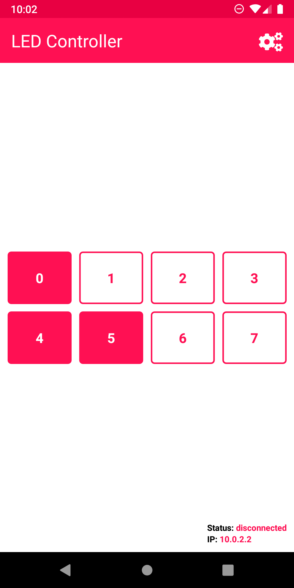
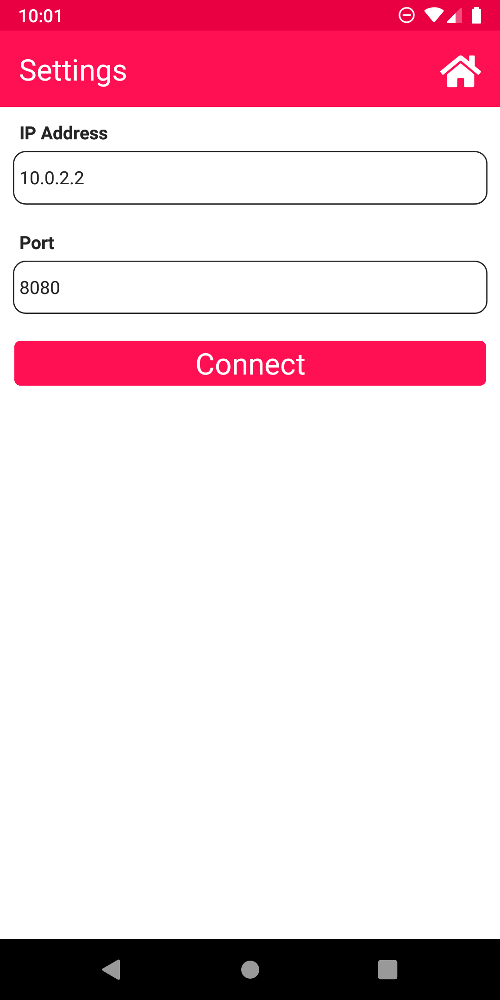

# ESP 32 Mobile LED Controller
Demo project showcasing the usage of various technologies like ESP32, React Native, and WebSocket. The functionality of the project is mainly about controlling a small LED array using a cross-platform mobile application. 

The data flow between the ESP32 (embedded system) and the mobile application relies, at the physical layer, on a WI-FI connection and, at the application layer, on a WebSocket connection.

## Screenshots

<p align="center">
  
  
</p>

## Getting the project
Clone the git project using
```sh
$ git clone https://github.com/julian-zatloukal/ESP-32-Mobile-LED-Controller.git
```

## Build the mobile application
### Setting up the environment
First make sure you have a proper environment to build the application. The project was originally developed on Linux 5.8 Ubuntu 20.10 (Groovy Gorilla) using the official React Native CLI and React Native 0.63.3. Check the [React Native CLI Quickstart](https://reactnative.dev/docs/environment-setup) guide for Android to ensure all dependencies are met.

### Start the metro server and build the Android application
Start metro server (here you can see the debug logs)
```sh
$ npx react-native start
```
Compile and run Android application
```sh
$ npx react-native run-android
```

## Build the embedded program
### Setting up the environment
The embedded program has been built using Platformio with the espressif32 platform. It’s recommended using the PlatformIO for VSCode or the PlatformIO Core (CLI) to build the project.
### Using PlatformIO for VSCode
1. Install the official VSCode extension.
2. Open a terminal inside the folder
```sh
$ code .
```
3. Press the check mark button at the bottom right of the IDE to compile or press Ctrl+F5.
4. To upload the compiled program use the arrow button placed next to the build button.

### PlatformIO Core (CLI)
1. Follow the official guide to install the [command line utility](https://docs.platformio.org/en/latest/core/installation.html#installer-script)
2. Build the project
```sh
$ pio run
```
3. Or build and upload to the board
```sh
$ pio run -t upload
```


